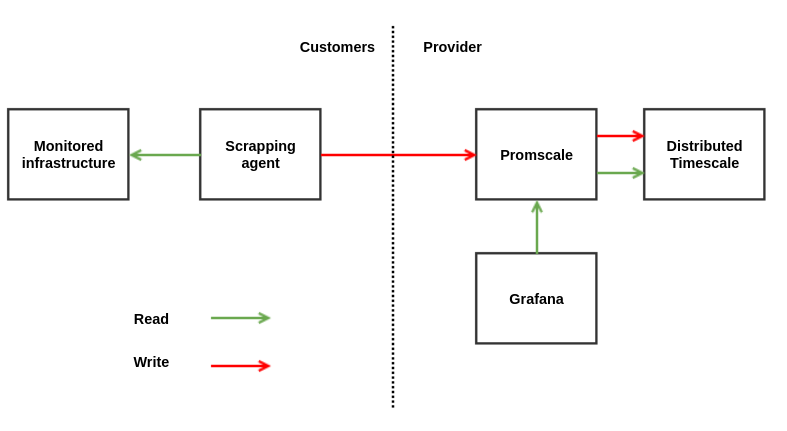

# Proof-of-concept infrastructure for TimescaleDB benchmark (2021)

This project has been run at OVHcloud between October 19, 2021 and November 15,
2021 to benchmark [TimescaleDB](https://github.com/timescale/timescaledb), the
[PostgreSQL](https://www.postgresql.org/) extension to manage time series, to
store [Prometheus](https://prometheus.io/) metrics on the long-term.

The idea was to deploy a disposable proof-of-concept infrastructure using
[Terraform](https://www.terraform.io/) and [Ansible](https://www.ansible.com/).

# Architecture

# Conclusion

As of October 2021, we do not recommend the use of TimescaleDB/Promscale in
production, here is why:

- We encountered several not corrected issues during the bench
- The solution would need a lot of homemade automation to be fully functional
- We are not able to ingest our minimal target

# Project status

This is an **example project** with no expected maintenance.
